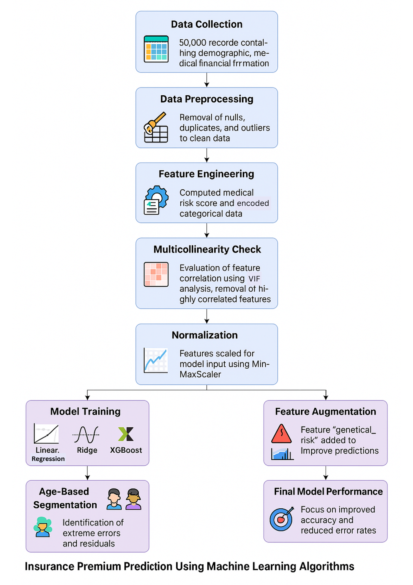

# 🧠 Insurance Premium Prediction using Machine Learning

This project aims to predict **annual health insurance premium amounts** using machine learning models trained on demographic, financial, and medical data.

We applied complete ML techniques, including:
- Data Cleaning & Outlier Handling
- Feature Engineering (Risk Score, Encoding)
- Normalization & VIF-based Feature Selection
- Model Training (Linear Regression, Ridge, XGBoost)
- Hyperparameter Tuning with RandomizedSearchCV
- Error Analysis & Age-Based Segmentation
- Feature Augmentation using `genetical_risk`
- 🔥 **Deployment using Streamlit + Joblib**

---

## 📊 Workflow



---

## 🧪 Models & Evaluation

| Model              | Train R² | Test R² | RMSE   |
|-------------------|----------|---------|--------|
| Linear Regression | 0.9282   | 0.9281  | 2272.8 |
| Ridge Regression  | 0.9282   | 0.9280  | 2272.8 |
| XGBoost Regressor | 0.9809   | 0.9782  | ~1788  |

After segmenting the dataset by age (<25 & ≥25) and adding `genetical_risk`, we reduced extreme error rates from **73% to just 2%** for younger users.

---

## 🛠️ Tech Stack

- Python 3.x
- Pandas, NumPy
- Scikit-learn
- XGBoost
- Matplotlib, Seaborn
- **Streamlit** – for building the web interface
- **Joblib** – for saving and loading the trained ML model

---

## 🚀 Run the Streamlit App

```bash
# Step 1: Clone the repo
git clone https://github.com/your-username/ML-Insurance-Premium-Prediction.git
cd ML-Insurance-Premium-Prediction

# Step 2: Install dependencies
pip install -r requirements.txt

# Step 3: Run the app
streamlit run main.py
